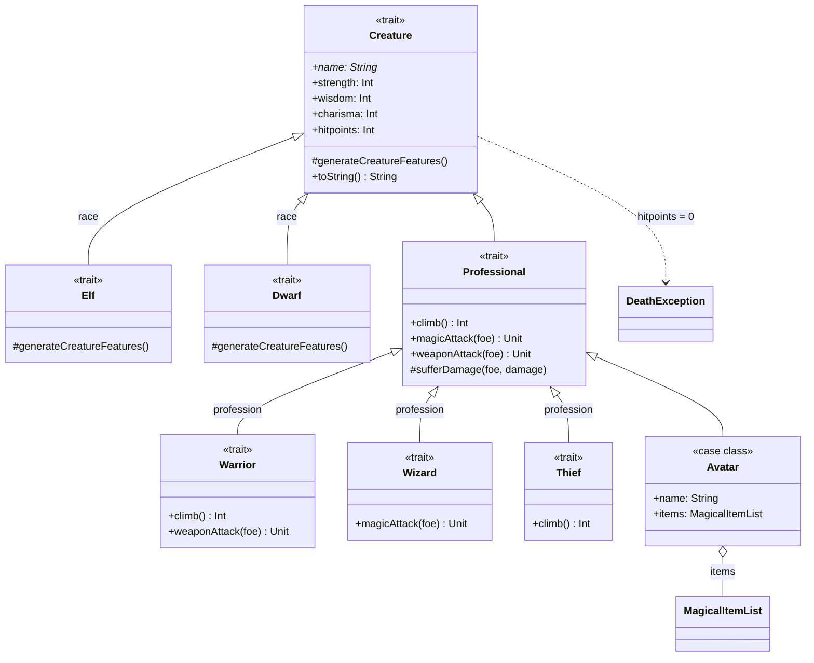

# ScalaLand

[](https://github.com/oluies/ScalaLand/actions/workflows/ci.yml)
[](https://www.scala-lang.org/)
[](https://www.scala-sbt.org/)
[](https://scala-steward.org)
**[Ett första steg i Scala](https://github.com/oluies/ScalaBook)**.

## Overview

ScalaLand is a small fantasy role-playing domain — creatures with
strength/wisdom/charisma, races (Elf, Dwarf), professions (Warrior,
Wizard, Thief) and magical items — that the book reimplements chapter by
chapter. Each `com.programmera.scalaland*` package is one chapter's take
on the same model: first with plain classes, then traits and mixin
composition, then immutability, functional style, and generics. The
Scala 3 sibling packages redo four chapters with modern idioms (`enum`,
trait parameters, `opaque type`, `given`/`using`) so old and new can be
read side by side.

The trait chapter's model is the heart of the book. A race and a
profession are mixed in at instantiation time — an `Avatar` without a
race fails on construction:

```scala
val bilbo = new Avatar("Bilbo") with Elf with Thief   // ok
Avatar("RogueWithoutRace")                            // IllegalArgumentException
```

### Class diagram (`scalaland_trait`)



`Creature` holds the mutable stats and throws `DeathException` when
hitpoints reach zero; the race traits override stat generation, the
profession traits override combat and climbing, and `Avatar` adds
magical items whose modifiers stack on top of the base stats. The
`DieRoll`, `MagicalItem*` and `CreatureFeature` helpers are re-exported
from earlier chapters via the package object.

## Status

| | |
|---|---|
| Scala | 3.3.8 (LTS) |
| sbt | 2.0.3 |
| JDK | 17 (also tested on 21) |
| Tests | 37, all green |

The repository is in the final phase of a Scala 2.8 → Scala 3 migration.
See [`MIGRATION_TO_SCALA3.md`](MIGRATION_TO_SCALA3.md) for the full plan
and per-phase commit log.

## Build

```bash
sbt compile                             # compile all sources
sbt testFull                            # run all smoke tests
sbt "scalafmtCheckAll; scalafmtSbtCheck" # check formatting
sbt "scalafixAll --check"               # check lint rules
```

Note (sbt 2): plain `sbt test` is incremental and may run zero tests on
an up-to-date build — use `testFull` for the whole suite. Multiple
commands on one invocation must be quoted and separated by `;`.

The first sbt invocation will fetch Scala 3.3.8, ScalaTest 3.2.20 and
the scalafix/scalafmt plugins.

## Layout — original (Scala 2 era) chapters

The classic chapters from the book, kept as a working reference under
Scala 3:

```
src/main/scala/com/programmera/
  scalaland1, scalaland1a, scalaland2, scalaland3, scalaland4   # class chapter
  scalaland_trait                                                # trait/mixin chapter
  scalaland_immutable1, _immutable2, _immutable3                 # objfunc chapter
  scalaland_func_final                                           # func chapter
  scalaland_generic                                              # generics chapter
```

A few of these (e.g. `scalaland_immutable1.Npc`,
`scalaland_immutable2.Npc`) are deliberately marked **"Incorrect"** in
their source comments — pedagogical anti-patterns the book uses to
contrast against the cleaner alternatives.

## Layout — Scala 3 sibling chapters

New packages introduced during the migration to demonstrate Scala 3
idioms against their Scala 2 originals:

| Package | Pairs against | Idioms |
|---|---|---|
| `scalaland_scala3_enum`    | `scalaland_immutable3` | `enum`, exhaustive match, no trait stacking |
| `scalaland_scala3_trait`   | `scalaland_trait`      | trait parameters, sealed traits, composition |
| `scalaland_scala3_func`    | `scalaland_func_final` | `opaque type`, `extension`, `given`/`using` |
| `scalaland_scala3_generic` | `scalaland_generic`    | typeclass via `given`, `summon`, match types |

The legacy chapters and the `_scala3_*` siblings are intended to be
read **side by side** — the contrast is the lesson.

## Companion book

The book itself lives at https://github.com/oluies/ScalaBook in DocBook
5 XML. Clone it as a sibling of this repo:

```bash
cd ~/projects && git clone https://github.com/oluies/ScalaBook.git
```

Tooling under `.claude/skills/docbook/` and (forthcoming)
`scripts/book/` reaches `../ScalaBook` by relative path. The two repos
stay independent — code lands here, prose lands in ScalaBook.
